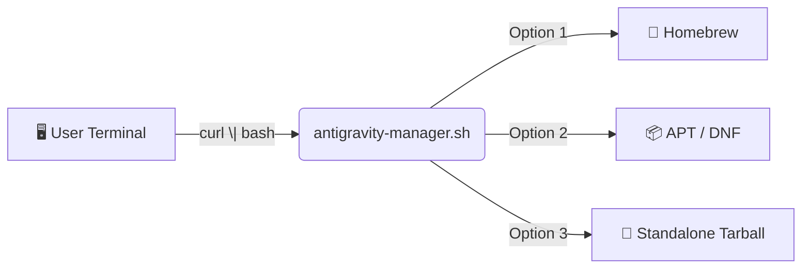

<p align="center">
  
  <a href="https://github.com/wtg-codes/agv-easy-install/actions/workflows/nightly-update.yml"></a>
  <a href="LICENSE"></a>
</p>

# 🚀 Google Antigravity — Easy Install

> **One command. Any shell. We get you coding.**

A cross-platform installer toolkit for [Google Antigravity](https://antigravity.google).
Paste the command, pick an option, and you're up and running.

---

## ⚡ Quick Start

**Option A — Interactive Guide (recommended for students)**

👉 **[Open the Interactive Installation Guide](https://wtg-codes.github.io/agv-easy-install/)**

**Option B — Direct install**

```bash
curl -fSsL "https://raw.githubusercontent.com/wtg-codes/agv-easy-install/main/antigravity-manager.sh" | bash
```

**Option C — Homebrew** *(macOS & Linux)*

```bash
brew install --cask antigravity   # macOS
brew install antigravity           # Linux
```

---

## 🏗️ Architecture



The installer detects your OS and package manager, then recommends the best method automatically.

---

## 💻 Supported Platforms

| Platform | Recommended Method | Fallback | Notes |
|---|---|---|---|
| **macOS** | Homebrew | — | Tarball is Linux-only; Homebrew required |
| **Ubuntu / Debian / Mint / Kali** | APT | Tarball | Auto-updates via system repo |
| **Fedora / RHEL / CentOS / Amazon Linux** | DNF | Tarball | Auto-updates via system repo |
| **Other Linux** | Tarball | — | Manual updates only |

<details>
<summary>📥 Manual tarball download (Linux only)</summary>

```bash
# This URL is updated nightly by CI
curl -fSsL "https://edgedl.me.gvt1.com/edgedl/release2/j0qc3/antigravity/stable/1.23.2-4781536860569600/linux-x64/Antigravity.tar.gz" \
  -o Antigravity.tar.gz
```

> If this URL fails, run the installer script instead — it always has the latest link.

</details>

---

## 📁 Install Locations (Tarball)

| Item | Path |
|---|---|
| Application | `~/.local/lib/antigravity` |
| Binary | `~/.local/bin/antigravity` |
| Manager | `~/.local/bin/antigravity-manager` |
| Workspace | `~/my-antigravity-work` |

---

## 🛠️ Troubleshooting

| Problem | Fix |
|---|---|
| `curl: (23) Failed writing body` | Update `curl`, or download the tarball manually |
| `antigravity: command not found` | Close and reopen your terminal, or run `source ~/.bashrc` |
| Homebrew formula not found | Run the installer script and choose Option 3 (Tarball) on Linux |

---

## 🗺️ Roadmap

> **Philosophy:** If you can get to a shell and paste a command, we help you install.
> The bash script **is** the cross-platform tool — each new OS adds a detection path.

| Milestone | Status |
|---|---|
| Linux repos (APT / DNF) | ✅ Done |
| Standalone tarball | ✅ Done |
| Homebrew (macOS + Linux) | ✅ Done |
| SHA-256 integrity checks | ✅ Done |
| Windows — WSL / Git Bash detection | 📋 Planned |
| macOS `.dmg` download fallback | 📋 Planned |

---

## 📝 Changelog

See **[CHANGELOG.md](CHANGELOG.md)** for release history.

---

## 🤝 Contributing

See **[CONTRIBUTING.md](CONTRIBUTING.md)** for guidelines.
All changes must pass `bash tests/run_gates.sh --phase all` before merging.

---

<p align="center">
  <sub>MIT License · Made for students · <a href="https://wtg-codes.github.io/agv-easy-install/">Interactive Guide</a></sub>
</p>
