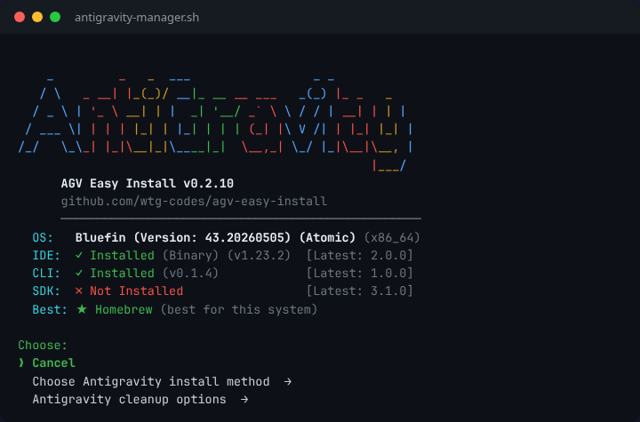
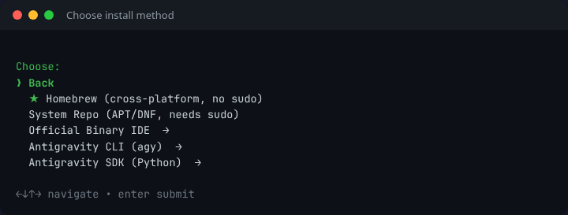
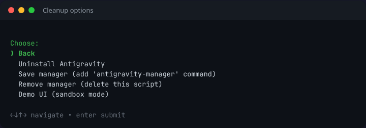
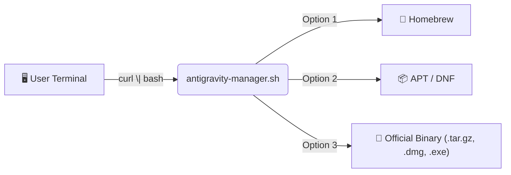

<p align="center">
  
  <a href="https://github.com/wtg-codes/agv-easy-install/actions/workflows/nightly-update.yml"></a>
  <a href="LICENSE"></a>
</p>

# 🚀 AGV Easy Install

> **Unofficial Google Antigravity setup by [wtg-codes](https://github.com/wtg-codes).**
> One command. Any shell. We get you coding.

<p align="center">
  
</p>

---

## ⚡ Quick Start

**Option A — Interactive Guide (recommended for students)**

👉 **[Open the Interactive Installation Guide](https://wtg-codes.github.io/agv-easy-install/)**

**Option B — Direct install**

```bash
curl -fSsL "https://raw.githubusercontent.com/wtg-codes/agv-easy-install/main/antigravity-manager.sh" | bash
```

**Option C — Advanced (Headless / Automation)**

The script supports non-interactive execution for CI/CD and provisioning tools:
```bash
# Auto-detect and install without prompts
curl -fSsL "https://raw.githubusercontent.com/wtg-codes/agv-easy-install/main/antigravity-manager.sh" | bash -s -- --auto

# Or force a specific method
bash antigravity-manager.sh --install-brew
bash antigravity-manager.sh --install-repo
bash antigravity-manager.sh --install-binary

# Additional options
bash antigravity-manager.sh --verbose  # Print detailed logs
bash antigravity-manager.sh --quiet    # Suppress non-error output
bash antigravity-manager.sh --check    # Verify existing installation health
bash antigravity-manager.sh --update   # Force update of this manager script
bash antigravity-manager.sh --remove   # Uninstall
bash antigravity-manager.sh --json     # Output single JSON object on completion
bash antigravity-manager.sh --demo-ui  # Sandbox mode — test the UI without installing
```

---

## 🖥️ What You'll See

The installer uses a hierarchical menu system — pick a category, then choose your method.

**1. Choose your install method →** The ★ marks the recommended option for your system.

<p align="center">
  
</p>

**2. Cleanup options →** Uninstall, manage the script, or try Demo UI mode.

<p align="center">
  
</p>

**3. Demo UI (sandbox mode)** — Test the full installation experience without changing your system.

<p align="center">
  
</p>

---

## 🏗️ Architecture



The installer detects your OS and package manager, then recommends the best method automatically.

---

## 💻 Supported Platforms

We support **Linux (APT/DNF/Atomic)**, **macOS (Homebrew/DMG)**, and **Windows (WSL2/Native)**.
The script automatically detects your environment and recommends the best installation path.

For detailed platform-specific architecture, see our documentation:
- [Linux Support Notes](docs/architecture/platform-linux.md)
- [macOS Support Notes (Beta)](docs/architecture/platform-macos.md)
- [Windows & WSL2 Notes (Beta)](docs/architecture/platform-windows.md)
- [ChromeOS Crostini Notes (Beta)](docs/architecture/platform-crostini.md)

<details>
<summary>📥 Manual binary download (Linux only)</summary>

```bash
# TARBALL_URL
curl -fSsL "https://edgedl.me.gvt1.com/edgedl/release2/j0qc3/antigravity/stable/1.23.2-4781536860569600/linux-x64/Antigravity.tar.gz" \
  -o Antigravity.tar.gz
```

> If this URL fails, run the installer script instead — it always has the latest link.

</details>

---

## 📁 Install Locations (Official Binary)

| Item | Path |
|---|---|
| Application | `~/.local/lib/antigravity` (Linux) / `/Applications` (macOS) |
| Binary | `~/.local/bin/antigravity` |
| Manager | `~/.local/bin/antigravity-manager` |
| Workspace | `~/my-antigravity-work` |

---

## 🛠️ Troubleshooting & Architecture

Having issues? Curious how the installer works under the hood or what's on the roadmap?

- **[Implementation Plan & Architecture](docs/architecture/implementation_plan.md)**
- **[Homebrew Install Details](docs/architecture/install-homebrew.md)**
- **[System Repo Install Details](docs/architecture/install-repo.md)**
- **[Official Binary Install Details](docs/architecture/install-tarball.md)**

If `curl` fails, ensure you have an active internet connection. If the `gum` UI fails to download, the script gracefully falls back to a plain text menu.

---

## 📝 Changelog

See **[CHANGELOG.md](CHANGELOG.md)** for release history and recent updates.

---

## 🤝 Contributing

See **[CONTRIBUTING.md](CONTRIBUTING.md)** for guidelines.
All changes must pass `bash tests/run_gates.sh --phase all` before merging.

---

<p align="center">
  <sub>MIT License · Made for students · <a href="https://wtg-codes.github.io/agv-easy-install/">Interactive Guide</a></sub>
</p>
