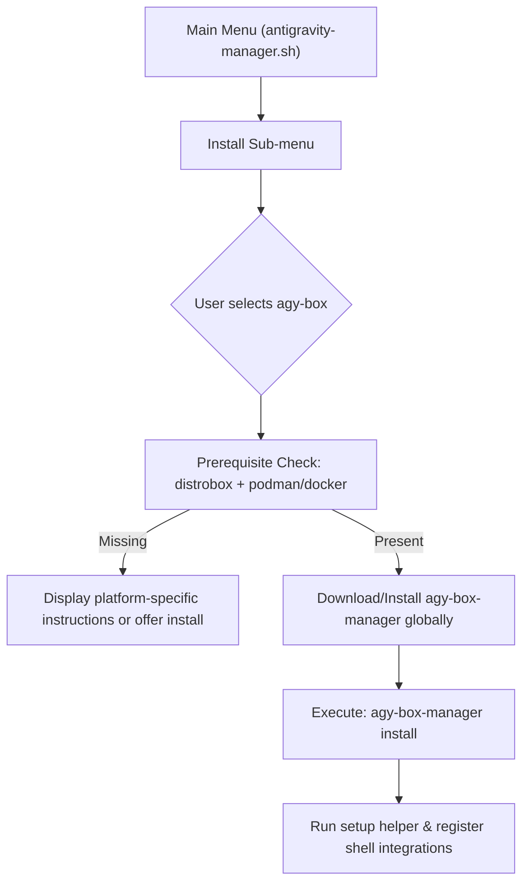

# Implementation Plan — `agy-box` Integration in `agy-easy-install`

## Goal
Integrate the **Antigravity Developer Sandbox (`agy-box`)** as a native installation choice inside the `agy-easy-install` interactive menu and automated command-line tool.

---

## Architecture Flow

The following diagram illustrates how the `agy-easy-install` script will orchestrate checking for prerequisites, installing the manager, and building the sandboxed environment.



---

## Proposed Changes

### 1. User Interface Additions
We will add `agy-box` to the interactive setup and manager menus in `antigravity-manager.sh`:

#### `install_submenu()`
* Add option: `"Antigravity Developer Sandbox (agy-box, containerized lab)  →"`
* Route to `install_agy_box()` when selected.

#### `cleanup_submenu()`
* Add option: `"Uninstall Antigravity Dev Box"`
* Route to `uninstall_agy_box()` when selected.

---

### 2. Dependency & Compatibility Checking
`agy-box` operates within a Distrobox container, which requires container runtime software on the host.

* **Linux (Standard / DNF / APT)**:
  * Check for `distrobox` and `podman`/`docker`.
  * If missing, offer to install them using `sudo apt install distrobox podman` or `sudo dnf install distrobox podman`.
* **Linux (Atomic / Universal Blue)**:
  * Distrobox and Podman are pre-installed. The script should verify the user is in the `docker` or `wheel`/`incus-admin` group if needed, or recommend running `ujust dx-group` to configure socket access.
* **macOS / Windows WSL2**:
  * Check for `distrobox` and `podman`/`docker` in the terminal environment.
  * If missing, display a clean guidance card on installing Podman Desktop (macOS) or enabling WSL2 + Podman (Windows).

---

### 3. Installer Implementation (`antigravity-manager.sh`)

We will define two new functions:

```bash
install_agy_box() {
    log_info "Verifying container sandboxing prerequisites..."
    
    # 1. Verify distrobox
    if ! command -v distrobox &>/dev/null; then
        log_warn "distrobox is not installed on the host."
        if [ "$PLATFORM" = "Linux" ] && [ -n "$PACKAGE_MANAGER" ]; then
            if gum confirm "Would you like to install distrobox and podman now?"; then
                # Install packages depending on DNF or APT
                if [ "$PACKAGE_MANAGER" = "apt" ]; then
                    sudo apt update && sudo apt install -y distrobox podman
                elif [ "$PACKAGE_MANAGER" = "dnf" ]; then
                    sudo dnf install -y distrobox podman
                fi
            else
                log_error "Sandbox installation cannot proceed without distrobox."
                return 1
            fi
        else
            log_error "Please install distrobox and a container manager (podman/docker) first."
            return 1
        fi
    fi

    # 2. Download and install agy-box-manager globally
    log_info "Downloading agy-box-manager CLI..."
    local target_dir="$HOME/.local/bin"
    mkdir -p "$target_dir"
    
    local remote_url="https://raw.githubusercontent.com/wtg-codes/agy-box/main/agy-box-manager"
    curl -fsSL "$remote_url" -o "$target_dir/agy-box-manager"
    chmod +x "$target_dir/agy-box-manager"

    # 3. Trigger sandbox installation
    log_info "Starting agy-box container setup..."
    "$target_dir/agy-box-manager" install
}

uninstall_agy_box() {
    local manager_bin="$HOME/.local/bin/agy-box-manager"
    if [ -f "$manager_bin" ]; then
        log_info "Uninstalling agy-box environment..."
        "$manager_bin" clean
        "$manager_bin" uninstall-global
    else
        log_warn "agy-box-manager is not installed globally."
    fi
}
```

---

### 4. Non-Interactive / Headless Mode
Add CLI arguments flag options:
* `--install-sandbox` / `--install-agy-box`: Triggers `install_agy_box` non-interactively (e.g. `agy-box-manager install --systemd` or standard).

---

## Verification Plan

### Automated Pipeline Checks
* Add a ShellCheck gating check in `tests/run_gates.sh` to verify syntax integrity.
* Add mock/dry-run verification to ensure `--demo-ui` works with the new menu choices.

### Manual Verification
* Run `./antigravity-manager.sh` on an Atomic Linux host (such as Fedora Silverblue/wtgOS) and install `agy-box`.
* Verify that:
  1. `distrobox` is detected.
  2. `agy-box-manager` is fetched and saved to `~/.local/bin/agy-box-manager`.
  3. The `agy-box` container is set up and the first-time setup assistant displays.
  4. Global shell wrappers (`ujust agy-status`) function correctly after install.
