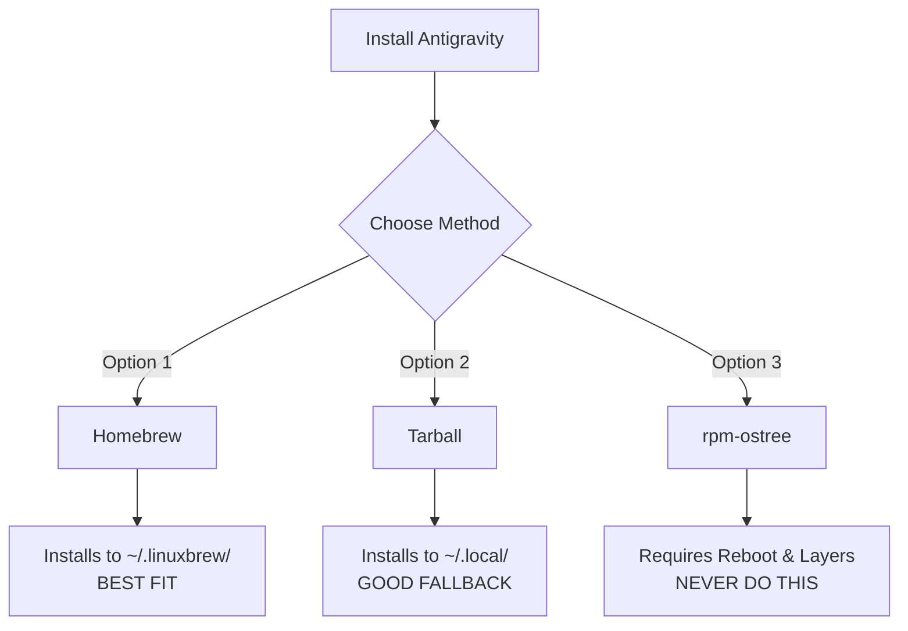

# Linux (Atomic/Immutable) — Bluefin, Silverblue, Bazzite

> **Status:** ✅ Tested (Bluefin)
> **Last updated:** 2026-05-13
> **Parent:** [platform-linux.md](platform-linux.md)

---

## What Are Atomic Desktops?

Atomic (immutable) Linux desktops use **OSTree** (the underlying storage engine) and **rpm-ostree** (the hybrid image/package manager) to manage the root filesystem as a versioned, read-only image (`/usr`). 

The base OS is updated atomically — either the entire update applies or it doesn't. You can roll back to a previous known-good deployment via the bootloader.

**Key principle:** Don't install user software to the host system. Use Homebrew, Flatpak, Distrobox, or `~/.local/` to keep the host "clean".

*📚 Reference:* [Fedora Silverblue Documentation](https://docs.fedoraproject.org/en-US/fedora-silverblue/)

---

## Supported Distributions

| `$DISTRO` / Detection | Name | Based On | Tested? |
|---|---|---|---|
| `bluefin` | Universal Blue Bluefin | Fedora Atomic | ✅ Tested |
| `bazzite` | Universal Blue Bazzite | Fedora Atomic | ⚠️ Expected |
| `/run/ostree-booted` exists | Fedora Silverblue | Fedora Atomic | ⚠️ Expected |
| `/run/ostree-booted` exists | Fedora Kinoite | Fedora Atomic | ⚠️ Expected |

### Detection Logic

The installer checks for standard Atomic flags during the `detect_platform` phase:
```bash
# src/20_platform.sh:198-202
IS_ATOMIC="no"
if [ -d /run/ostree-booted ] || [ "$DISTRO" = "bluefin" ] || [ "$DISTRO" = "bazzite" ]; then
    IS_ATOMIC="yes"
fi
```

---

## Why APT/DNF Don't Work Here

| Problem | Architectural Detail |
|---|---|
| **`/usr` is read-only** | You cannot write to `/usr/bin/` or `/usr/lib/`. |
| **No `apt`** | These systems are Fedora-based, not Debian-based. |
| **`dnf` is missing** | DNF is not available on OSTree-managed systems. |
| **`rpm-ostree install`** | Technically works, but "layers" packages on top of the base image. This requires a reboot and makes OS updates significantly slower and more fragile. |

---

## Recommended Install Hierarchy



### Why Homebrew is the Recommended Path

Universal Blue projects (Bluefin, Bazzite) ship with **Homebrew installed by default** and officially recommend it for all CLI/TUI tools.
- Installs to `/home/linuxbrew/.linuxbrew/` (writable).
- No `sudo` needed.
- Completely separated from the immutable OS root.

### Tarball Fallback

If Homebrew is unavailable (e.g., on a stock Fedora Silverblue installation), the installer will gracefully fall back to a **Tarball** installation.
- Installs binaries to `~/.local/bin/`.
- `~/.local` resides in `/var/home/` on OSTree systems, which is fully writable.

---

## Flatpak Chrome Handling & Bubblewrap

Atomic desktops heavily rely on Flatpak for GUI applications, including Google Chrome.

> [!CAUTION]
> **Sandboxing Collision:** Flatpak uses Bubblewrap (`bwrap`) to isolate applications. If Antigravity tries to spawn Chrome using `flatpak run com.google.Chrome`, the sandbox will prevent bidirectional child-process communication, breaking Antigravity.

To bypass this, the Antigravity installer searches for the **raw, un-sandboxed Flatpak binary path** inside the host's `/var/lib/flatpak` or `~/.local/share/flatpak` storage:
```bash
/var/lib/flatpak/app/com.google.Chrome/current/active/files/extra/chrome
```
This allows Antigravity to spawn Chrome natively on the host, avoiding Bubblewrap entirely.

---

## Containers: Distrobox & Toolbox

Many developers on Atomic Linux use **Distrobox** or **Toolbx** to spin up mutable, containerized environments (via Podman) that feel native to the host.

If a user runs the `agv-easy-install` script *inside* a Distrobox container (e.g., an Ubuntu container), the script will correctly identify the environment as `ubuntu` and install via the APT System Repo.

**This is safe and supported.** The container provides a mutable `/usr` filesystem, and Distrobox automatically maps the container's exported `.desktop` files to the host.

---

## Essential Atomic Skills & Tools

1. **`rpm-ostree status`**: View your current OS deployments, layered packages, and pending updates.
2. **`flatpak list --app`**: List installed Flatpak applications (helpful to verify Chrome is present).
3. **`ujust` / `just`**: Universal Blue's command runner for system maintenance. Try `ujust update`.
4. **`distrobox enter <name>`**: Drop into a containerized, mutable Linux environment for development work.
