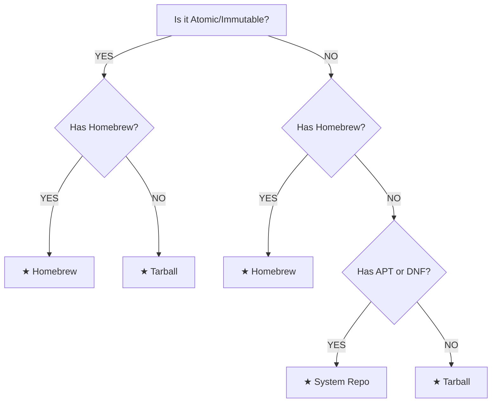

# Linux Support — Architecture Notes

> **Status:** ✅ Tested — primary platform.
> **Last updated:** 2026-05-13

---

## Overview

Linux is the primary and fully-tested platform for Antigravity. All three install methods (Homebrew, APT/DNF, Tarball) are supported. This is the umbrella documentation detailing the common behaviors across all Linux variants. 

See the sub-platform docs for distribution-specific details:

| Sub-Platform | Doc | Package Manager | Status |
|---|---|---|---|
| Debian/Ubuntu family | [platform-linux-apt.md](platform-linux-apt.md) | APT | ✅ Tested |
| Fedora/RHEL family | [platform-linux-dnf.md](platform-linux-dnf.md) | DNF | ✅ Tested |
| Atomic/Immutable | [platform-linux-atomic.md](platform-linux-atomic.md) | Homebrew / Tarball | ✅ Tested |

---

## Detection Mechanism

```bash
PLATFORM=$(uname -s)  # Returns "Linux"
```

### Distribution Detection (`detect_distro`)

The installer reads `/etc/os-release` (a standard systemd file) to accurately identify the distribution without relying on legacy tools like `lsb_release`.

```bash
# Sourcing the file safely grabs variables like $ID
. /etc/os-release
DISTRO="$ID"
```
*📚 Reference:* [os-release(5) — Linux manual page](https://www.freedesktop.org/software/systemd/man/latest/os-release.html)

### Recommendation Logic (`detect_platform`)

The script dynamically recommends the safest install method:



---

## XDG Base Directory Specification

Antigravity aggressively adheres to the **XDG Base Directory Specification** to prevent "dotfile pollution" in the user's home directory. 

*📚 Reference:* [XDG Base Directory Spec](https://specifications.freedesktop.org/basedir-spec/basedir-spec-latest.html)

| Directory | Variable | Path Used by Installer | Purpose |
|---|---|---|---|
| Configuration | `$XDG_CONFIG_HOME` | `~/.config/Antigravity` | Settings, Chrome path maps. |
| User Data | `$XDG_DATA_HOME` | `~/.local/share/` | `.desktop` application launchers. |
| Executables | (Custom FHS) | `~/.local/bin/` | Symlinks to the binary (tarball). |
| Application | (Custom FHS) | `~/.local/lib/` | Application libraries (tarball). |

### Desktop Shortcuts (`.desktop` Files)

`.desktop` files are created using `xdg-user-dir DESKTOP` (falling back to `~/Desktop`). 
Post-install trust is crucial to prevent "Untrusted Application Launcher" warnings in modern GNOME/KDE:

```bash
# Make executable
chmod +x ~/Desktop/google-antigravity.desktop
# Set GNOME trusted metadata
gio set ~/Desktop/google-antigravity.desktop metadata::trusted true
# Update system application database
update-desktop-database ~/.local/share/applications
```

---

## Flatpak Sandboxing Quirks (Bubblewrap)

Many modern Linux distributions (like Linux Mint or Fedora) install Google Chrome via Flatpak by default. 

Flatpak uses **Bubblewrap (`bwrap`)** to run applications in isolated namespaces. By default, applications have no access to the host filesystem or host processes.

If Antigravity attempts to launch Chrome using the `flatpak run com.google.Chrome` command, the sandbox will intercept the execution and prevent child-process communication (which Antigravity relies on for agentic control).

**The Bypass:** The installer prioritizes finding the **raw Chrome binary** inside the Flatpak directory hierarchy, bypassing the Bubblewrap sandbox execution entirely:
1. ` /var/lib/flatpak/app/com.google.Chrome/.../chrome` (System-wide Flatpak)
2. `~/.local/share/flatpak/app/com.google.Chrome/.../chrome` (User-local Flatpak)

*📚 Reference:* [Flatpak Under the Hood (Bubblewrap)](https://docs.flatpak.org/en/latest/under-the-hood.html)

---

## Wayland vs X11 (Electron)

Modern distributions (Ubuntu 22.04+, Fedora 34+) default to the **Wayland** display server protocol.
Historically, Electron applications running on Wayland defaulted to XWayland (an X11 compatibility layer), resulting in blurry fonts on fractional scaling setups.

**2024 Status:** Electron 38+ automatically detects Wayland and switches to native Wayland rendering. 
If an older version of Antigravity is packaged, you may need to manually pass the ozone flags to prevent blurriness:

```bash
antigravity --ozone-platform-hint=auto
# Or via environment variable:
ELECTRON_OZONE_PLATFORM_HINT=auto antigravity
```

---

## Essential Linux Skills & Tools

To effectively debug Antigravity installations on Linux, familiarize yourself with these tools:

1. **`ldd`**: Print shared object dependencies. Useful if the tarball binary fails to launch with a "missing shared library" error.
   * `ldd ~/.local/lib/antigravity/antigravity`
2. **`strace`**: Trace system calls and signals. Crucial for debugging "permission denied" errors when Antigravity tries to spawn Chrome.
   * `strace -e trace=file antigravity`
3. **`gio`**: GNOME Input/Output tool. Used to manage `.desktop` file trust metadata.
   * `gio info ~/Desktop/google-antigravity.desktop`
4. **`update-desktop-database`**: Rebuilds the MIME type cache for `.desktop` files in `~/.local/share/applications`.
