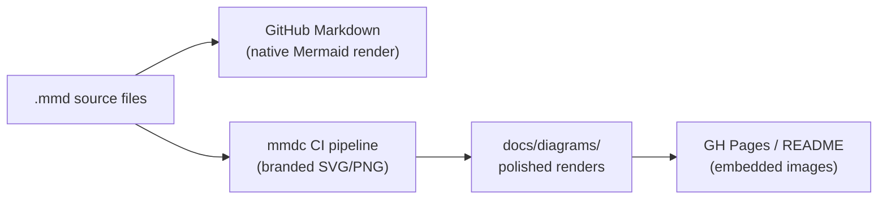
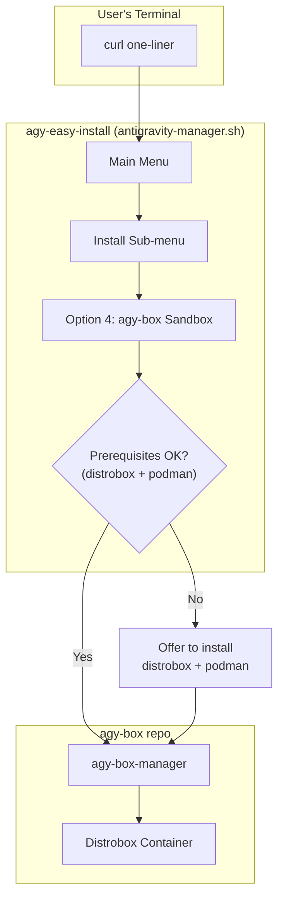

# 🗺️ Master Plan — agy-box & agy-easy-install

> [!NOTE]
> This is a **PLAN ONLY** document. No code changes are to be made until the plan is reviewed and approved.

---

## Table of Contents

- [Workstream 1: agy-box Documentation & GH Pages](#workstream-1-agy-box-documentation--gh-pages)
- [Workstream 2: Visual Diagram Enhancement](#workstream-2-visual-diagram-enhancement)
- [Workstream 3: Repo Rename Migration (agv → agy)](#workstream-3-repo-rename-migration-agv--agy)
- [Workstream 4: Downstream Integration (agy-box ↔ agy-easy-install)](#workstream-4-downstream-integration-agy-box--agy-easy-install)
- [Decision Log](#decision-log)

---

## Workstream 1: agy-box Documentation & GH Pages

### Current State Assessment

| Asset | Status | Quality |
|-------|--------|---------|
| [README.md](file:///home/wtg/Repos/agy-box/README.md) | ✅ Exists (372 lines) | Good — but has broken `file:///` links, thin Testing section, missing changelog |
| [docs/architecture.md](file:///home/wtg/Repos/agy-box/docs/architecture.md) | ✅ Exists (249 lines) | Excellent — 4 Mermaid diagrams, deep technical detail |
| [docs/SETUP.md](file:///home/wtg/Repos/agy-box/docs/SETUP.md) | ✅ Exists (89 lines) | Good — concise but only 4 FAQ items |
| [docs/index.html](file:///home/wtg/Repos/agy-box/docs/index.html) | ✅ Exists (700 lines) | Excellent — polished Tailwind landing page with Mermaid |
| [CONTRIBUTING.md](file:///home/wtg/Repos/agy-box/CONTRIBUTING.md) | ✅ Exists (58 lines) | Decent — missing Code of Conduct, issue templates, DCO |
| Code of Conduct | ❌ Missing | — |
| Changelog | ❌ Missing | — |
| Settings Reference | ❌ Missing | Noted in TODO.md |
| GH Pages workflow | ✅ [pages.yml](file:///home/wtg/Repos/agy-box/.github/workflows/pages.yml) | Working — deploys `docs/` to Pages |

### Identified Gaps

#### README.md
- **Broken links**: Lines 22-24 use `file:///var/home/wtg/...` protocol — these only work locally, not on GitHub web
- **Missing screenshots/GIFs**: No visual demo of the TUI manager or VDI desktop embedded in README
- **Thin Testing section**: Only ~5 lines, doesn't document the 10 scripts in `scripts/`
- **Missing commands**: `doctor` and `ports` subcommands exist in the manager but aren't documented in the command reference table
- **No changelog section** or link to releases
- **No "What's New"** section for recent features

#### GitHub Pages (`docs/index.html`)
- Landing page is polished but **diagrams use simplified labels** vs. the richer `architecture.md` versions
- **No multi-page navigation** — everything is one monolithic HTML file
- **No search** functionality
- Mermaid diagrams use JS dark theme but **no icon nodes** — just text labels
- **No link** from the landing page to the setup/troubleshooting guide

#### Missing Docs
- `docs/settings-reference.md` — user settings schema for AGY IDE and CLI
- `CODE_OF_CONDUCT.md` — standard community document
- `CHANGELOG.md` — version history
- `.github/ISSUE_TEMPLATE/` — bug report and feature request templates
- `.github/PULL_REQUEST_TEMPLATE.md`

### Proposed Improvements

| Priority | Change | Branch |
|----------|--------|--------|
| 🔴 High | Fix `file:///` links in README to use relative GitHub links | `fix/readme-links` |
| 🔴 High | Add `doctor` and `ports` to command reference table | `fix/readme-links` |
| 🟡 Medium | Add CODE_OF_CONDUCT.md (Contributor Covenant) | `docs/community` |
| 🟡 Medium | Add issue + PR templates in `.github/` | `docs/community` |
| 🟡 Medium | Create `docs/settings-reference.md` | `docs/settings-ref` |
| 🟡 Medium | Expand SETUP.md with more FAQ/troubleshooting entries | `docs/setup-expansion` |
| 🟢 Low | Add screenshots/GIFs of TUI manager to README | `docs/screenshots` |
| 🟢 Low | Add CHANGELOG.md or link to GitHub Releases | `docs/changelog` |
| 🟢 Low | Consider multi-page docs site (see Workstream 2) | Future |

---

## Workstream 2: Visual Diagram Enhancement

### Current Diagram Inventory

**12 Mermaid diagrams** across both repos. No standalone `.mmd` files exist — all are inline in Markdown or HTML.

#### agy-box Diagrams (8 total)

| # | File | Lines | Type | Depicts | Complexity | Styled? |
|---|------|-------|------|---------|------------|---------|
| 1 | [architecture.md](file:///home/wtg/Repos/agy-box/docs/architecture.md#L11-L72) | 11–72 | `graph TD` | System Topology | HIGH (15 nodes, ~18 edges, 4 subgraphs) | ✅ 4 classDef |
| 2 | [architecture.md](file:///home/wtg/Repos/agy-box/docs/architecture.md#L80-L151) | 80–151 | `sequenceDiagram` | Setup Assistant Flow | VERY HIGH (6 actors, ~30 msgs) | ✅ 5 style |
| 3 | [architecture.md](file:///home/wtg/Repos/agy-box/docs/architecture.md#L161-L197) | 161–197 | `graph LR` | D-Bus Keyring Pipeline | MEDIUM (7 nodes, ~10 edges) | ✅ 3 classDef |
| 4 | [architecture.md](file:///home/wtg/Repos/agy-box/docs/architecture.md#L219-L247) | 219–247 | `graph TD` | VDI Web Desktop | MEDIUM (7 nodes, ~6 edges) | ✅ 2 classDef |
| 5 | [README.md](file:///home/wtg/Repos/agy-box/README.md#L80-L146) | 80–146 | `graph TD` | Layered Architecture | HIGH (16 nodes, ~20 edges) | ✅ 4 classDef |
| 6 | [README.md](file:///home/wtg/Repos/agy-box/README.md#L154-L185) | 154–185 | `flowchart LR` | Suite Communication | MEDIUM (9 nodes, ~8 edges) | ✅ 2 classDef |
| 7 | [index.html](file:///home/wtg/Repos/agy-box/docs/index.html#L274-L325) | 274–325 | `graph TD` (HTML) | Layered Arch (simplified) | HIGH (14 nodes) | ⚠️ JS theme only |
| 8 | [index.html](file:///home/wtg/Repos/agy-box/docs/index.html#L336-L360) | 336–360 | `flowchart LR` (HTML) | Suite Comm (simplified) | MEDIUM (9 nodes) | ⚠️ JS theme only |

#### agv-easy-install Diagrams (4 total — all unstyled)

| # | File | Lines | Type | Depicts | Complexity | Styled? |
|---|------|-------|------|---------|------------|---------|
| 9 | [README.md](file:///home/wtg/Repos/agv-easy-install/README.md#L95-L102) | 95–102 | `graph TD` | Installer Overview | LOW (6 nodes) | ❌ None |
| 10 | [platform-linux.md](file:///home/wtg/Repos/agv-easy-install/docs/architecture/platform-linux.md#L43-L56) | 43–56 | `graph TD` | Linux Recommendation | LOW-MED (9 nodes) | ❌ None |
| 11 | [platform-linux-atomic.md](file:///home/wtg/Repos/agv-easy-install/docs/architecture/platform-linux-atomic.md#L56-L66) | 56–66 | `graph TD` | Atomic Install Hierarchy | LOW (6 nodes) | ❌ None |
| 12 | [agy_box_integration_plan.md](file:///home/wtg/Repos/agv-easy-install/docs/architecture/agy_box_integration_plan.md#L12-L21) | 12–21 | `graph TD` | agy-box Integration | LOW-MED (8 nodes) | ❌ None |

### Tooling Comparison Matrix

| Feature | Mermaid + mmdc | D2 | Kroki | Excalidraw |
|---------|---------------|-----|-------|------------|
| **Icon Support** | Iconify (200K+) via JS API; FA inline | Any URL/local SVG | Via underlying renderer | ❌ manual only |
| **Icons in CI** | ⚠️ Complex (Puppeteer + registerIconPacks) | ✅ Easy (just URLs) | ⚠️ Depends on renderer | ❌ |
| **Theme Quality** | Good (5 built-in + custom vars) | Excellent (20+ themes + dark mode) | Pass-through to renderer | Hand-drawn only |
| **Visual Polish** | Medium-High | **High** (best auto-layout) | Medium-High | Low (informal) |
| **CI Friendliness** | ✅ Excellent (`npx mmdc`) | ✅ Excellent (single binary) | ✅ Good (Docker/API) | ⚠️ Poor |
| **GitHub Native Render** | ✅ Yes (but no icons) | ❌ No | ❌ No | ❌ No |
| **Mermaid as Source** | ✅ Native | ⚠️ No auto-converter | ✅ Renders Mermaid | ⚠️ Flowcharts only |
| **Ecosystem Maturity** | ★★★★★ | ★★★☆☆ | ★★★★☆ | ★★★★☆ |

### Trusted Icon Sources

| Library | Icons | Best For | License |
|---------|-------|----------|---------|
| **Lucide** (lucide.dev) | 1,500+ | Clean UI icons | ISC |
| **Simple Icons** (simpleicons.org) | 3,000+ | Brand/product logos (Docker, GitHub, Google, etc.) | CC0 1.0 |
| **Material Design Icons** | 7,000+ | Google ecosystem, general purpose | Apache 2.0 |
| **Font Awesome Free** | 2,000+ | General purpose (only option for Mermaid inline) | CC BY 4.0 / MIT |
| **Heroicons** | 300+ | Tailwind ecosystem | MIT |
| **Terrastruct Icons** | AWS/GCP/Azure/dev | Architecture diagrams (D2 native) | MIT |

### Recommended Strategy: Dual-Layer Approach

> [!IMPORTANT]
> **Source of truth = Mermaid (`.mmd` files)** — always. The polished visual renders are a *derived output*.



#### Layer 1: Mermaid Source (`.mmd` files)
- Extract all inline Mermaid blocks into standalone `docs/diagrams/src/*.mmd` files
- These are the **editable source of truth**
- GitHub renders them natively in Markdown (basic styling, no icons)
- Apply consistent `classDef` theming across all diagrams (the agy-box ones already have a good color scheme)

#### Layer 2: Polished Renders (CI-generated SVGs)
- **Tool**: `@mermaid-js/mermaid-cli` (`mmdc`) — stays in the Mermaid ecosystem, no new language to learn
- **Theme**: Custom `config.json` with branded `themeVariables` (indigo/slate palette matching the existing `index.html`)
- **Icons**: Font Awesome inline icons (`fa:fa-name`) for key nodes — this is the **only icon method that works reliably in mmdc without complex Puppeteer setup**
- **Output**: SVG files committed to `docs/diagrams/rendered/`
- **CI**: GitHub Action on push that auto-renders changed `.mmd` → `.svg` and commits

#### Which Icons Make Sense Where

| Diagram | Icon Candidates | Source |
|---------|----------------|--------|
| System Topology | `fa:fa-desktop` (Host), `fa:fa-cube` (Container), `fa:fa-plug` (Bridge) | Font Awesome |
| Suite Communication | `fa:fa-robot` (Agent UI), `fa:fa-code` (IDE), `fa:fa-terminal` (CLI), `fa:fa-cloud` (Google Cloud) | Font Awesome |
| D-Bus Keyring | `fa:fa-lock` (Keyring), `fa:fa-key` (Credentials), `fa:fa-exchange` (D-Bus) | Font Awesome |
| VDI Web Desktop | `fa:fa-tv` (Display), `fa:fa-globe` (Browser), `fa:fa-window-maximize` (Window Manager) | Font Awesome |
| Installer Overview | `fa:fa-download` (Install), `fa:fa-beer` (Homebrew), `fa:fa-box` (Container) | Font Awesome |

> [!TIP]
> **Future upgrade path**: If D2 matures or we outgrow FA icons, we can add a D2-based rendering layer alongside Mermaid without changing the source. D2 accepts any SVG URL as an icon, giving access to Simple Icons, Lucide, etc. with zero lock-in.

#### Proposed CI Workflow (`render-diagrams.yml`)

```
on:
  push:
    paths: ['docs/diagrams/src/**/*.mmd']

jobs:
  render:
    steps:
      - checkout
      - npx mmdc -i <file>.mmd -o <file>.svg -c docs/diagrams/config.json
      - git-auto-commit "Auto-render diagrams"
```

#### Proposed Directory Structure

```
docs/
├── diagrams/
│   ├── config.json           # Branded Mermaid theme config
│   ├── src/
│   │   ├── system-topology.mmd
│   │   ├── setup-assistant.mmd
│   │   ├── dbus-keyring.mmd
│   │   ├── vdi-desktop.mmd
│   │   ├── suite-communication.mmd
│   │   └── layered-architecture.mmd
│   └── rendered/
│       ├── system-topology.svg
│       ├── setup-assistant.svg
│       ├── dbus-keyring.svg
│       ├── vdi-desktop.svg
│       ├── suite-communication.svg
│       └── layered-architecture.svg
├── architecture.md           # References rendered SVGs + links to .mmd source
├── SETUP.md
└── index.html                # Embeds rendered SVGs instead of inline Mermaid
```

---

## Workstream 3: Repo Rename Migration (agv → agy)

### Decision: New Repo Name

| Option | Name | Verdict |
|--------|------|---------|
| **A ⭐** | `agy-easy-install` | ✅ **Recommended** — direct typo fix, preserves brand recognition, matches `agy-box` and `agy` CLI naming |
| B | `agy-setup` | Shorter but loses brand recognition |
| C | `agy-installer` | Generic |

### Decision: Ink Variant

> **KILLED.** The `agv-easy-install-ink` repo and local folder have been deleted. The Bash variant (`v0.2.15`) is the sole path forward with multi-product support, agy-box integration, and 77 test gates. The Ink variant (`v0.2.8`) only supported IDE installation and had zero agy-box integration.
>
> **Action**: Archive `agv-easy-install-ink` on GitHub with a deprecation banner. No further work needed.

### Link Audit — Every `agv-easy-install` Reference

#### In Script Source (`src/`)
| File | Line | Reference |
|------|------|-----------|
| `src/00_config.sh` | 22 | `VERSIONS_JSON_URL` → `raw.githubusercontent.com/wtg-codes/agv-easy-install/...` |
| `src/00_config.sh` | 65 | `MANAGER_URL` → `raw.githubusercontent.com/wtg-codes/agv-easy-install/...` |
| `src/20_platform.sh` | 367 | Banner: `github.com/wtg-codes/agv-easy-install` |
| `src/99_main.sh` | 71 | Self-update check URL |

#### In README.md
- Lines 2-9: 6 badge image URLs (CI, Nightly, Pages workflows)
- Line 32: Interactive guide link
- Lines 37, 45: curl install commands
- Line 173: Footer link

#### In `docs/index.html` (GH Pages)
- Line 166: curl command
- Line 356: Footer repo link
- Line 365: JS `commandToCopy`
- Line 428: JS `fetch()` URL for source viewer

#### In Other Files
- `AGENTS.md`, `CONTRIBUTING.md`, `CHANGELOG.md`: Title references
- `.github/workflows/nightly-update.yml`: Implicit repo references

### Migration Phases

#### Phase 1: Preparation (Day 1 — ~30 min)

- [ ] Finalize name: `agy-easy-install`
- [ ] Prepare `sed` script for bulk `agv-easy-install` → `agy-easy-install` replacement
- [ ] Audit and verify all references listed above

#### Phase 2: Create New Repo (Day 1 — ~30 min)

- [ ] Create `wtg-codes/agy-easy-install` on GitHub (empty, MIT license)
- [ ] Clone current `agv-easy-install` locally
- [ ] Run bulk URL replacement across all files
- [ ] Fix remaining branding: "AGV" → "AGY" in banner text, TODO title, etc.
- [ ] Push to new repo
- [ ] Configure GitHub Pages (Settings → Pages → Deploy from `docs/`)
- [ ] Set up branch protection on `main`
- [ ] Enable GitHub Actions
- [ ] Manually trigger `workflow_dispatch` on CI to verify

#### Phase 3: Verify New Repo (Day 1–2 — ~30 min)

- [ ] Test curl one-liner: `curl -fSsL "https://raw.githubusercontent.com/wtg-codes/agy-easy-install/main/antigravity-manager.sh" | bash`
- [ ] Verify GitHub Pages at `https://wtg-codes.github.io/agy-easy-install/`
- [ ] Wait for nightly CI run to verify automated updates work
- [ ] Run full gate tests (77 gates) on the new repo

#### Phase 4: Deprecate Old Repo (Day 2 — ~30 min)

##### 4a. Giant README Banner
Add to the very top of `agv-easy-install/README.md`:

```markdown
> [!CAUTION]
> ## ⚠️ THIS REPO HAS MOVED
>
> **This repository has been renamed and relocated to
> [`agy-easy-install`](https://github.com/wtg-codes/agy-easy-install).**
>
> - 🆕 **New repo**: [github.com/wtg-codes/agy-easy-install](https://github.com/wtg-codes/agy-easy-install)
> - 📖 **New docs**: [wtg-codes.github.io/agy-easy-install](https://wtg-codes.github.io/agy-easy-install/)
> - 📦 **New install command**:
>   ```
>   curl -fSsL "https://raw.githubusercontent.com/wtg-codes/agy-easy-install/main/antigravity-manager.sh" | bash
>   ```
>
> This repository is **archived** and will no longer receive updates.
```

##### 4b. Update Old Installer Script to Redirect
In `src/00_config.sh`, update `MANAGER_URL` and `VERSIONS_JSON_URL` to point to the **new** repo. Rebuild via `build.sh`. This ensures:
- Users who `curl` the old script get the redirect
- The `--update` self-update mechanism pulls from new repo

Add deprecation warning to banner output in `src/20_platform.sh`:
```
⚠️  This script URL is deprecated! Update your bookmark:
   github.com/wtg-codes/agy-easy-install
```

##### 4c. GitHub Pages Redirect
Replace `docs/index.html` with a minimal page that auto-redirects to the new site after 3 seconds, styled with the same dark theme.

##### 4d. Archive the Old Repo
- Settings → Archive this repository (makes it read-only, preserves history/stars/links)

##### 4e. Archive the Ink Repo
- Add same deprecation banner to `agv-easy-install-ink` README
- Archive the repo

#### Phase 5: Cross-Repo Reference Updates (Day 2–3)

- [ ] Update `agy-box` references to `agv-easy-install` (if any exist in README, architecture docs, etc.)
- [ ] Update any course materials or external docs that link to the old repo

### Timeline

| Step | When | Duration |
|------|------|----------|
| Finalize name + prepare patches | Day 1 | 30 min |
| Create new repo + push | Day 1 | 30 min |
| Configure Pages + Actions + verify | Day 1 | 30 min |
| Wait for nightly CI | Day 2 | Overnight |
| Deprecate old repos (README + script + Pages) | Day 2 | 30 min |
| Archive old repos | Day 3 | 5 min |
| **Total active time** | | **~2 hours** |

### Risk Mitigation

| Risk | Mitigation |
|------|------------|
| Users curl old URL | Old script updated to point MANAGER_URL to new repo; self-update pulls from new repo. `raw.githubusercontent.com` continues serving archived repos. |
| Existing bookmarks to GH Pages | `<meta http-equiv="refresh">` redirect on old `docs/index.html` |
| Google/SEO indexing | Meta refresh + archived repo with "MOVED" in description; Google will re-index |
| Users who saved curl command locally | Old URL continues to work indefinitely (repo archived, not deleted) |
| GitHub stars/forks lost | Acceptable trade-off; mention original repo in new README |

---

## Workstream 4: Downstream Integration (agy-box ↔ agy-easy-install)

### Current State

The Bash variant of `agv-easy-install` already has **deep agy-box integration work in progress**:

- Currently on branch `feature/agy-box-install`
- Full integration plan at [agy_box_integration_plan.md](file:///home/wtg/Repos/agv-easy-install/docs/architecture/agy_box_integration_plan.md)
- agy-box appears as **Option 4** in the install menu (alongside Homebrew, APT/DNF, Official Binary)
- Downloads `agy-box-manager` from `https://raw.githubusercontent.com/wtg-codes/agy-box/main/agy-box-manager`
- CLI flag: `--install-sandbox` / `--install-agy-box`
- Already referenced in README (line 53, line 101)

### Integration Architecture



### Integration Points to Formalize

| Integration Point | Current State | Needed Work |
|-------------------|---------------|-------------|
| **agy-box-manager download** | Curls from `raw.githubusercontent.com/wtg-codes/agy-box/main/agy-box-manager` | ✅ Works — but should pin to a release tag, not `main` |
| **Version coordination** | agy-box is at `v0.5.0`, easy-install at `v0.2.15` | Need a shared `versions.json` or release-tag-based discovery |
| **Prerequisite detection** | easy-install checks for distrobox + podman | ✅ Already implemented in the integration plan |
| **Error handling** | ? | Need to handle: agy-box-manager download failure, container build failure, distrobox not supported on macOS |
| **Shared branding** | Both use different color schemes and banner art | Standardize on the agy-box indigo/slate palette |
| **Documentation cross-linking** | agy-box README doesn't mention easy-install; easy-install README mentions agy-box | Add bidirectional links |

### Proposed Integration Plan (for the NEW `agy-easy-install` repo)

#### Branch Strategy
- Carry over the `feature/agy-box-install` branch work into the new repo
- Rebase onto `main` of the new `agy-easy-install` repo
- Complete integration testing before merging

#### Key Design Decisions Needed

> [!WARNING]
> These need answers before implementation:

1. **Should agy-box-manager be pinned to a release tag or always pull `main`?**
   - Release tag = stability, but requires manual version bumps
   - `main` = always latest, but could break if agy-box pushes a bad commit

2. **Should the easy-install `versions.json` track agy-box versions?**
   - Currently `versions.json` tracks IDE/CLI/SDK versions
   - Adding agy-box would let the nightly scraper auto-update the container image tag

3. **Should easy-install offer agy-box on macOS?**
   - Distrobox works on macOS via Lima/Colima but it's not well-tested
   - Could show a warning instead of blocking

4. **Should the agy-box-manager script be vendored or always fetched?**
   - Vendoring = works offline, version-locked
   - Fetching = always latest, smaller repo, but requires internet

---

## Decision Log

| # | Decision | Status | Notes |
|---|----------|--------|-------|
| 1 | New repo name: `agy-easy-install` | 🟡 Proposed | Awaiting user confirmation |
| 2 | Kill Ink variant | ✅ Done | Local folder deleted, archive GitHub repo |
| 3 | Mermaid as diagram source of truth | ✅ Decided | Extract to `.mmd` files, keep editable |
| 4 | Diagram rendering tool: `mmdc` (Mermaid CLI) | 🟡 Proposed | Simplest path, FA icons, CI-friendly |
| 5 | Icon library: Font Awesome (inline) | 🟡 Proposed | Only option that works reliably in mmdc without complex setup |
| 6 | Old repo strategy: deprecate + archive | ✅ Decided | Banner + redirect + archive |
| 7 | agy-box-manager pinning strategy | ❓ Open | Release tag vs main — needs decision |
| 8 | versions.json scope expansion | ❓ Open | Should it track agy-box versions? |
| 9 | macOS agy-box support | ❓ Open | Warning vs block |
